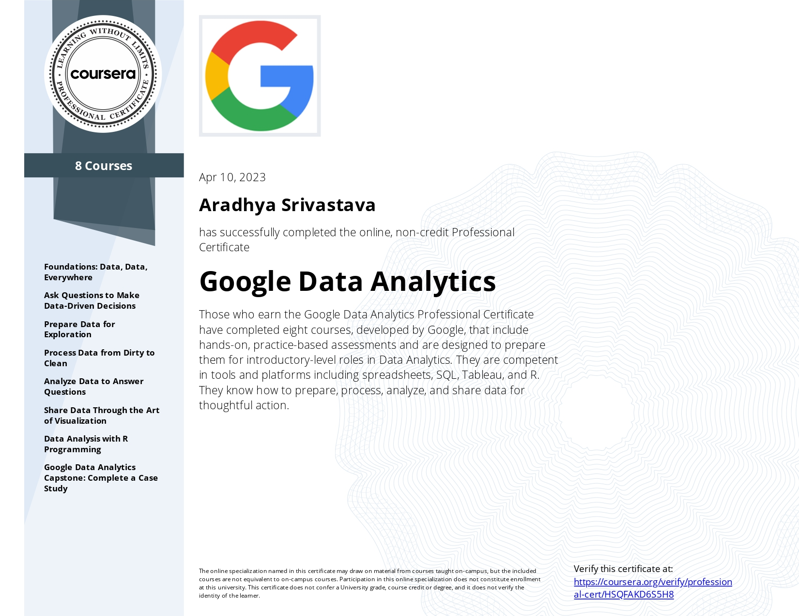

# Google Data Analytics Professional Certificate Capstone Project

The capstone projects from Coursera's Google Data Analytics Professional Certificate Course can be found in this repository. These projects are from "Track 1" of the curriculum, offering certain data sets to be examined. Two separate scenario/case studies have currently been examined here. 

## Cyclistic: How does a bike-share company navigate speedy success?

In order to increase profits and entice casual users to switch to annual membership subscriptions, the bike-sharing firm Cyclistic is first looking for usage patterns between the membership kinds of its consumers. The specifics of this analytical report are available in this .

## Bellabeat: How  a wellness company play it smart?

A wellness startup called Bellabeat is looking for fitness tracker usage trends in order to enhance the features it offers and significantly improve the fitness situations of its consumers. The specifics of this analytical report are available in this.

## Certificate of Completion

